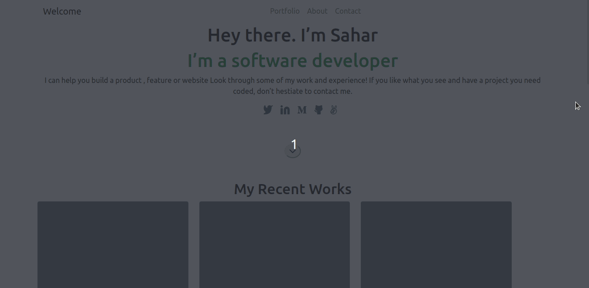

# Portfolio-using-bootstrap

> This is an exercice that will help us practice using Bootstrap.
> It is a copy of the Portfolio repository, with bootstrap instead of CSS.

## Below is a GIF showing my Portfolio


This website is a setup and mobile version skeleton of my portfolio.

## Setup

### Clone this repository

```bash
$ git clone git@github.com:Sahar-AbdelSamad/Portfolio-using-Bootstrap.git
$ cd Portfolio-using-Bootstrap
```
### Run the live server or open index.html with your browser
## Built With

- HTML
- Bootstrap
- VSCode

## Author

👤 **Sahar Abdel Samad**

- GitHub: [@sahar-abdelsamad](https://github.com/Sahar-AbdelSamad)
- Twitter: [@abdelsamadsahar](https://twitter.com/AbdelSamadSahar)
- LinkedIn: [sahar-abdel-samad](https://www.linkedin.com/in/sahar-abdel-samad/)

👤 **Mauro Vasconcelos**

- GitHub: [@vanillainanutshell](https://github.com/vanillainanutshell)
- LinkedIn: [Mauro Vasconcelos](https://www.linkedin.com/in/mauro-vasconcelos-a3671a223/)

## 🤝 Contributing

Contributions, issues, and feature requests are welcome!

Feel free to check the [issues page](https://github.com/Sahar-AbdelSamad/Portfolio-using-bootstrap/issues).

## Show your support

Give a ⭐️ if you like this project!

## 📝 License

This project is [MIT](LICENSE) licensed.